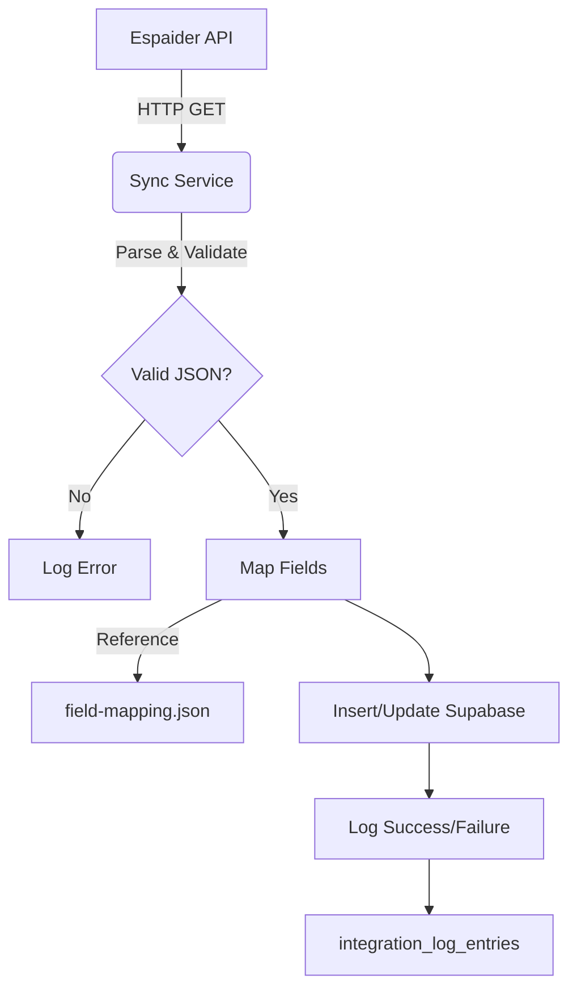

# Espaider Sync Workflow

> **Standard Operating Procedure** for syncing data between Espaider API and local Supabase database.

---

## 🏗️ Architecture Overview

## 🔄 Sync Phases

### Phase 1: Fetch from Espaider

- **Method:** HTTP GET
- **Auth:** Bearer Token (Simulated/Real)
- **Retry Policy:** 3 attempts, exponential backoff (see `error-handling.md`)

### Phase 2: Parse & Validate

- Check if response is array or object
- Validate essential fields (`IDPROJETO` must exist)
- **Action:** If invalid, skip record + log warning.

### Phase 3: Map Fields

- Convert Espaider Types → Supabase Types
- Example: `DATAINICIO` (String "2023-01-01") → `Date` object
- Handle `NULL` values using defensive checks.

### Phase 4: Persistence (Supabase)

- Use **Upsert** (Insert or Update) based on `id_espaider`.
- **RLS Context:** Ensure service role or correct user tenant is set.

### Phase 5: Audit Logging

- **Success:** Log count of records synced.
- **Failure:** Log stack trace and raw payload excerpt.

---

## 🛠️ implementation Checklist

- [ ] Credentials configured in `.env`?
- [ ] `integration_log_entries` table exists?
- [ ] Field mapping matches current API version?
- [ ] RLS policies allow the sync user to write?
