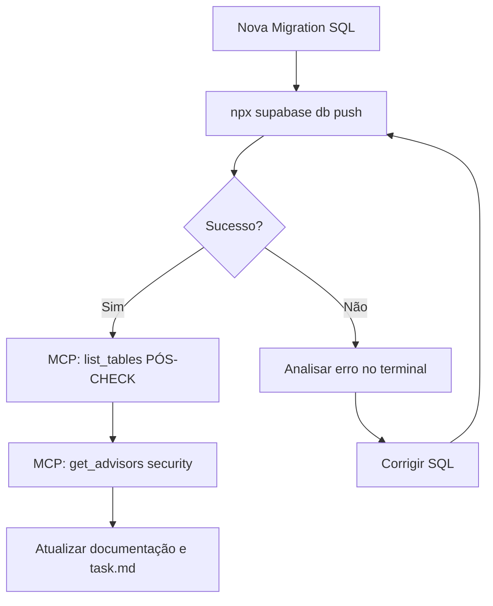
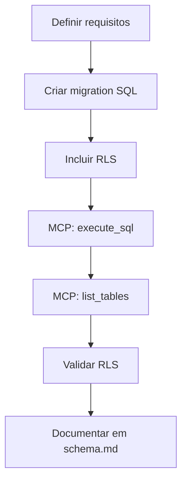
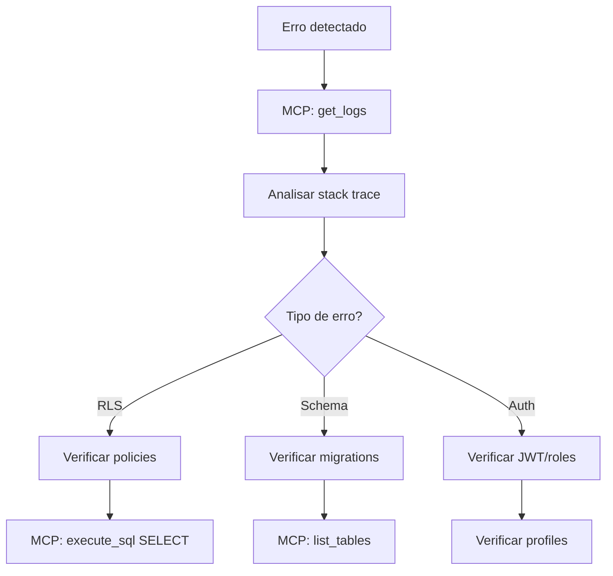

# Skill: Supabase MCP Integration

> **Versão**: 1.2.0
> **Última Atualização**: 2026-02-10
> **Agentes**: database-architect, backend-specialist, orchestrator

## Propósito

Esta skill padroniza o uso do MCP Supabase para operações de banco de dados, migrations, RLS e debugging no projeto Tech Arauz.

## Pré-requisitos

1. MCP Supabase configurado em `.cursor/mcp.json` **com project_ref**
2. Autenticação OAuth realizada (browser login) — **expira periodicamente**
3. Acesso ao projeto Supabase da organização
4. **Reiniciar Cursor após alterar mcp.json**

## Configuração MCP

> **OBRIGATÓRIO**: Sempre incluir `?project_ref=` para project-scoping.
> Sem isso, o MCP retorna "permission denied" em todas as operações.

```json
{
  "mcpServers": {
    "supabase": {
      "url": "https://mcp.supabase.com/mcp?project_ref=pybmawlwpmxshtccpqui"
    }
  }
}
```

## Troubleshooting MCP

### "Permission denied" em todas as operações

1. Verificar `?project_ref=` na URL do MCP
2. Reiniciar o Cursor (mcp.json é lido no startup)
3. Re-autenticar via browser (OAuth expira)
4. Testar com `list_tables` como smoke test

## Tools Disponíveis

### 🚨 REGRA DE OURO: Inspeção de Schema (MANDATORY) 🚨

**NUNCA** leia arquivos em `supabase/migrations/*.sql` para entender a estrutura atual do banco de dados. Migrations são históricas, incrementais e frequentemente sobrescritas.
Para descobrir quais tabelas, colunas ou relações existem: **SEMPRE USE O MCP** (`list_tables`, `get_table_schema`), pois ele consulta o banco real e atualizado.
Os arquivos de migrations só devem ser lidos se o objetivo for estritamente debugar um script antigo que falhou ou criar uma nova migration baseada em padrões anteriores (e mesmo assim, com cautela e após verificar o banco vivo).

### Gestão de Schema

| Tool               | Descrição              | Uso                    |
| ------------------ | ---------------------- | ---------------------- |
| `list_tables`      | Lista todas as tabelas | Verificar schema atual |
| `get_table_schema` | Detalhes de uma tabela | Análise de estrutura   |
| `execute_sql`      | Executa SQL arbitrário | Migrations, queries    |
| `list_extensions`  | Lista extensões        | Verificar features     |

### Debugging

| Tool         | Descrição       | Uso                  |
| ------------ | --------------- | -------------------- |
| `get_logs`   | Logs do projeto | Debugging, auditoria |
| `get_config` | Configurações   | Verificar settings   |

### Migrations

| Tool              | Descrição             | Uso           |
| ----------------- | --------------------- | ------------- |
| `list_migrations` | Migrations existentes | Status atual  |
| `apply_migration` | Aplicar migration     | Deploy schema |

## Workflows

### WF-001: Aplicar Migration (Protocolo Oficial)

O CLI do Supabase é a fonte da verdade e o método **oficial e automatizado** para aplicar migrations. O MCP atua como ferramenta de validação PÓS-CHECK.



**Passos (OBRIGATÓRIOS):**

1. **APLICAR VICA CLI**: Executar `npx supabase db push` (se interativo, usar `--force` ou responder 'y' via script/terminal).
2. **PÓS-CHECK**: Use `list_tables` e `get_table_schema` do MCP para confirmar que as tabelas/colunas foram criadas na nuvem.
3. **AUDIT**: Execute `get_advisors(security)` para assegurar que não há falhas na RLS criada pela migration.
4. **FALLBACK MCP**: O uso da tool `apply_migration` do MCP é **desencorajado** como método primário, servindo apenas como plano B se o CLI local estiver indisponível ou quebrado.
5. Em caso de erro, analise o retorno do próprio command-line do Supabase.
6. **NUNCA** atualizar arquivos de log como resolvidos sem o PÓS-CHECK.

> **PADRONIZAÇÃO (2026-02-21)**: O uso de `npx supabase db push` garante que a constraint de schema do Supabase seja gerenciada de forma consistente com a stack Supabase padrão. O MCP deve focar em consultar o banco real, não em gerenciá-lo.

### WF-002: Criar Nova Tabela



**Template de Tabela:**

```sql
-- Migration: XXX_create_nome_tabela.sql

CREATE TABLE IF NOT EXISTS public.nome_tabela (
    id UUID PRIMARY KEY DEFAULT gen_random_uuid(),
    tenant_id UUID NOT NULL REFERENCES public.tenants(id) ON DELETE CASCADE,
    -- campos específicos
    created_at TIMESTAMPTZ NOT NULL DEFAULT NOW(),
    updated_at TIMESTAMPTZ NOT NULL DEFAULT NOW()
);

-- Índices
CREATE INDEX idx_nome_tabela_tenant ON public.nome_tabela(tenant_id);

-- Trigger updated_at
CREATE TRIGGER set_updated_at
    BEFORE UPDATE ON public.nome_tabela
    FOR EACH ROW EXECUTE FUNCTION public.set_updated_at();

-- RLS
ALTER TABLE public.nome_tabela ENABLE ROW LEVEL SECURITY;

-- Policies
CREATE POLICY "tenant_isolation" ON public.nome_tabela
    FOR ALL USING (tenant_id = public.get_user_tenant_id());

CREATE POLICY "admin_full_access" ON public.nome_tabela
    FOR ALL USING (public.get_user_role() = 'admin');
```

### WF-003: Debug de Erro



### WF-004: Seed de Dados

**Ordem de execução:**

1. `seed.sql` - Tenant base
2. Usuário via Supabase Auth Dashboard
3. Profile via `execute_sql` INSERT

```sql
-- Exemplo: Criar profile admin
INSERT INTO public.profiles (id, tenant_id, email, full_name, role)
VALUES (
    '<auth_user_id>',
    '00000000-0000-0000-0000-000000000001', -- tenant arauz
    'admin@arauz.com.br',
    'Admin Arauz',
    'admin'
);
```

## Checklist de Validação (OBRIGATÓRIO)

### Após Migration

- [ ] `list_tables` executado — tabelas esperadas existem
- [ ] `execute_sql("SELECT tablename, rowsecurity FROM pg_tables WHERE schemaname = 'public'")` — RLS habilitado
- [ ] `get_advisors(security)` — sem warnings de RLS ausente
- [ ] Índices confirmados via `execute_sql("SELECT indexname FROM pg_indexes WHERE schemaname = 'public'")`
- [ ] Documentação em `supabase/docs/` atualizada com status "Aplicado" + data + evidência

### Após Migration 004 (espaider_apis)

- [ ] `list_tables` — 8 tabelas no schema public (inclui espaider_apis)
- [ ] `execute_sql("SELECT COUNT(*) FROM public.espaider_apis")` — 4 APIs seed
- [ ] RLS habilitado na espaider_apis (4 policies: SELECT all, INSERT/UPDATE/DELETE admin)

### Após Seed

- [ ] `execute_sql("SELECT id, slug, name FROM public.tenants")` — tenant Araúz & Advogados existe
- [ ] Profile admin criado via INSERT
- [ ] `execute_sql("SELECT id, email, role FROM public.profiles")` — role correta

### Smoke Test Completo

- [ ] `npm run dev` inicia sem erros de conexão com Supabase
- [ ] Dashboard carrega dados (ou exibe "sem dados" corretamente)
- [ ] Login funciona com usuário admin

## Troubleshooting

### Erro: "permission denied for table"

```sql
-- Verificar RLS
SELECT tablename, rowsecurity FROM pg_tables
WHERE schemaname = 'public';

-- Verificar policies
SELECT * FROM pg_policies WHERE tablename = 'nome_tabela';
```

### Erro: "violates foreign key constraint"

```sql
-- Verificar se tenant existe
SELECT * FROM public.tenants;

-- Verificar se user existe em auth
SELECT id, email FROM auth.users;
```

### Erro: Migration falhou

1. Verificar logs: `get_logs`
2. Reverter se necessário: criar migration de rollback
3. Nunca editar migration já aplicada

## Integração com Agentes

### database-architect

- Responsável por design de schema
- Usa esta skill para aplicar migrations
- Valida RLS e índices

### backend-specialist

- Usa para queries de debug
- Integra com client Espaider
- Valida sync de dados

### security-auditor

- Audita policies RLS
- Verifica tenant isolation
- Testa permissões por role

## Referências

- **Schema atual**: `supabase/migrations/`
- **Documentação**: `supabase/README.md`, `supabase/docs/`
- **Supabase MCP Docs**: <https://supabase.com/docs/guides/getting-started/mcp>
