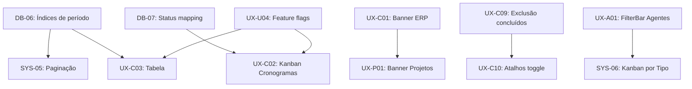

# Technical Debt Assessment — FINAL

Data: 2026-02-28
Versão: 2.0 (PRD UX/UI 2026)
Gate QA: APPROVED
Orquestração: @aios-master (Orion) — Brownfield Discovery
PRD: Padronização UX/UI + Cronogramas Read-Only + Tecnologia & IA

---

## Executive Summary

- Gaps identificados vs PRD: **35**
- Bloqueantes (decisão de produto): **2** (resolvidos com defaults do PRD)
- Críticos/Altos: **22**
- Médios/Baixos: **13**
- Esforço total estimado: **~250 horas**
- Timeline recomendada: **4 sprints**

### Decisões tomadas (defaults do PRD)

| Decisão                                                         | Resolução                                                                       | Justificativa                                                      |
| --------------------------------------------------------------- | ------------------------------------------------------------------------------- | ------------------------------------------------------------------ |
| DP-01: Campos `prioridade`, `progresso`, `etiquetas[]` ausentes | **Omitir.** Tabela/Kanban com 7 colunas. Usar `atrasado` como badge de urgência | Campos não existem na API Espaider (confirmado por @data-engineer) |
| DP-02: DnD em Projetos Kanban                                   | **Desabilitar.** Kanban somente visual                                          | PRD: "somente leitura" (confirmado por @ux-design-expert)          |
| DP-03: Status mapping para Kanban                               | Pendente → Colunas Kanban: Pendente, Em Execução, Atrasada, Concluída           | Baseado em domínio + `atrasado` boolean                            |

---

## 1. Inventário consolidado

### 1.1 Database (validado por @data-engineer)

| ID    | Débito                                                     | Severidade | Horas | Sprint |
| ----- | ---------------------------------------------------------- | ---------- | ----: | ------ |
| DB-01 | Histórico de regressão RLS em child tables (ciclo 016→027) | Crítica    |    20 | 4      |
| DB-02 | Token sensível em `espaider_apis.token`                    | Alta       |    12 | 4      |
| DB-03 | Tenant hardcoded em seeds/código                           | Alta       |    10 | 4      |
| DB-04 | Auth dividida entre DB e app sem matriz documentada        | Alta       |     8 | 4      |
| DB-06 | Sem índice em `project_schedules(data_inicio, data_fim)`   | Alta       |     4 | 1      |
| DB-07 | Status mapping (API → UI) não documentado                  | Alta       |     4 | 1      |
| DB-09 | Sem política de retenção para logs                         | Média      |    12 | 4      |
| DB-10 | Sem baseline de restore/recovery drill                     | Alta       |    14 | 4      |
| DB-11 | Migrations com sobreposição (sem snapshot consolidado)     | Média      |     8 | 4      |
| DB-12 | Campos de domínio sem constraints                          | Média      |    16 | 4      |

### 1.2 Cronogramas — Read-Only (validado por @ux-design-expert)

| ID     | Débito                                             | Severidade | Horas | Sprint |
| ------ | -------------------------------------------------- | ---------- | ----: | ------ |
| UX-C01 | Banner ERP ausente                                 | Alta       |     4 | 1      |
| UX-C02 | Kanban não implementado                            | Alta       |    12 | 2      |
| UX-C03 | Lista renderiza cards (não tabela)                 | Alta       |    10 | 2      |
| UX-C04 | Bug `getWeekStart()` — semana no domingo           | Alta       |     2 | 1      |
| UX-C05 | Layout de container inconsistente                  | Média      |     3 | 3      |
| UX-C08 | Filtros com labels em inglês                       | Média      |     2 | 3      |
| UX-C09 | Exclusão de concluídos por padrão                  | Alta       |     3 | 2      |
| UX-C10 | Atalhos "incluir concluídos" ausentes              | Alta       |     4 | 2      |
| UX-C11 | Indicador de urgência (usar `atrasado` como badge) | Média      |     3 | 2      |

### 1.3 Projetos — Read-Only (validado por @ux-design-expert)

| ID     | Débito                                         | Severidade | Horas | Sprint |
| ------ | ---------------------------------------------- | ---------- | ----: | ------ |
| UX-P01 | Banner ERP ausente                             | Alta       |     2 | 1      |
| UX-P02 | DnD no Kanban altera dados (desabilitar)       | Alta       |     4 | 2      |
| UX-P03 | Botão "Sincronizar" renomear para "Recarregar" | Média      |     2 | 2      |
| UX-P04 | Subtítulo diz "gerencie"                       | Baixa      |     1 | 3      |
| UX-P05 | Tooltip "somente leitura" ausente              | Média      |     2 | 2      |

### 1.4 Sidebar/Navegação

| ID     | Débito                              | Severidade | Horas | Sprint |
| ------ | ----------------------------------- | ---------- | ----: | ------ |
| SYS-01 | Grupo "Tecnologia & IA" inexistente | Alta       |     4 | 1      |

### 1.5 Agentes AI — CRUD (validado por @ux-design-expert)

| ID     | Débito                                 | Severidade | Horas | Sprint |
| ------ | -------------------------------------- | ---------- | ----: | ------ |
| UX-A01 | Filtros ad-hoc (não usa FilterBar)     | Alta       |     8 | 2      |
| UX-A02 | Kanban manual (não usa KanbanBoard)    | Média      |     6 | 3      |
| SYS-06 | Kanban por status (PRD exige por Tipo) | Média      |     8 | 2      |

### 1.6 Cadastros Auxiliares (validado por @ux-design-expert)

| ID     | Débito                                          | Severidade | Horas | Sprint |
| ------ | ----------------------------------------------- | ---------- | ----: | ------ |
| UX-T01 | Título "Provedores de LM" vs "Fornecedores IA"  | Alta       |     1 | 1      |
| UX-T03 | Modelos sem Cockpit dedicado                    | Média      |     6 | 3      |
| UX-T04 | Bug: Kanban Modelos muda provider sem persistir | Alta       |     3 | 3      |
| UX-T07 | DashboardHeader sem prop `actions`              | Média      |     4 | 3      |

### 1.7 UX Universal (validado por @ux-design-expert e @qa)

| ID     | Débito                              | Severidade | Horas | Sprint |
| ------ | ----------------------------------- | ---------- | ----: | ------ |
| UX-U01 | Baseline acessibilidade WCAG AA     | Alta       |    16 | 3      |
| UX-U02 | Feedback async sem padrão           | Média      |     6 | 3      |
| UX-U03 | Empty/loading/error inconsistentes  | Média      |     8 | 3      |
| UX-U04 | Feature flags para novas views      | Média      |     6 | 2      |
| SYS-05 | Paginação server-side (Cronogramas) | Alta       |    12 | 2      |

---

## 2. Plano de execução por sprint

### Sprint 1 — Fundação (Semana 1-2)

**Objetivo:** Criar base para implementação PRD. Quick wins + desbloqueios.

| ID           | Tarefa                                                        | Horas   | Agente         |
| ------------ | ------------------------------------------------------------- | ------- | -------------- |
| DB-06        | Criar índices de período em `project_schedules`               | 4       | @dev           |
| DB-07        | Documentar status mapping (query banco real)                  | 4       | @data-engineer |
| SYS-01       | Sidebar: reorganizar grupos                                   | 4       | @dev           |
| UX-C01/P01   | Criar `ErpReadOnlyBanner` + inserir em Cronogramas e Projetos | 6       | @dev           |
| UX-C04       | Fix bug `getWeekStart()`                                      | 2       | @dev           |
| UX-T01       | Corrigir título "Fornecedores IA"                             | 1       | @dev           |
| **Subtotal** |                                                               | **21h** |                |

### Sprint 2 — Core PRD (Semana 3-4)

**Objetivo:** Implementar requisitos centrais do PRD.

| ID           | Tarefa                                     | Horas   | Agente  |
| ------------ | ------------------------------------------ | ------- | ------- |
| UX-C02       | Kanban Cronogramas (read-only, sem DnD)    | 12      | @dev    |
| UX-C03       | Tabela Cronogramas (7 colunas, ordenação)  | 10      | @dev    |
| SYS-05       | Paginação server-side Cronogramas          | 12      | @dev    |
| UX-C09/C10   | Exclusão de concluídos + atalhos toggle    | 7       | @dev    |
| UX-C11       | Badge urgência (`atrasado`)                | 3       | @dev    |
| UX-P02       | Desabilitar DnD em Projetos                | 4       | @dev    |
| UX-P03/P05   | Renomear "Sincronizar" + tooltip read-only | 4       | @dev    |
| UX-A01       | Migrar filtros de Agentes para FilterBar   | 8       | @dev    |
| SYS-06       | Kanban de Agentes por Tipo                 | 8       | @dev    |
| UX-U04       | Feature flags para novas views             | 6       | @devops |
| **Subtotal** |                                            | **74h** |         |

### Sprint 3 — Qualidade e consistência (Semana 5-6)

**Objetivo:** Padronizar UX, a11y, e resolver inconsistências.

| ID           | Tarefa                                    | Horas   | Agente     |
| ------------ | ----------------------------------------- | ------- | ---------- |
| UX-U01       | Baseline acessibilidade WCAG AA           | 16      | @dev + @qa |
| UX-U02       | Padrão feedback async (sonner + inline)   | 6       | @dev       |
| UX-U03       | Padronizar empty/loading/error states     | 8       | @dev       |
| UX-A02       | Migrar Kanban Agentes para KanbanBoard    | 6       | @dev       |
| UX-T03       | Criar ModelCockpit dedicado               | 6       | @dev       |
| UX-T04       | Fix bug DnD Modelos                       | 3       | @dev       |
| UX-T07       | DashboardHeader prop `actions`            | 4       | @dev       |
| UX-C05       | Fix layout container Cronogramas          | 3       | @dev       |
| UX-C08/P04   | Internacionalizar labels + ajustar textos | 3       | @dev       |
| **Subtotal** |                                           | **55h** |            |

### Sprint 4 — Segurança e governança (Semana 7-8)

**Objetivo:** Resolver dívida técnica de segurança e governança DB.

| ID           | Tarefa                             | Horas    | Agente                |
| ------------ | ---------------------------------- | -------- | --------------------- |
| DB-01        | RLS test suite automatizada no CI  | 20       | @data-engineer + @qa  |
| DB-02        | Token handling (secret manager)    | 12       | @dev + @data-engineer |
| DB-03        | Remover tenant hardcode            | 10       | @dev                  |
| DB-04        | Documentar matriz de autorização   | 8        | @data-engineer        |
| DB-10        | Baseline restore/recovery          | 14       | @data-engineer        |
| DB-09        | Política de retenção de logs       | 12       | @data-engineer        |
| DB-11        | Snapshot consolidado de migrations | 8        | @data-engineer        |
| DB-12        | Constraints em campos de domínio   | 16       | @data-engineer        |
| **Subtotal** |                                    | **100h** |                       |

---

## 3. Dependências de execução

**Regra:** Nenhuma task do Sprint 2 deve começar sem as tasks do Sprint 1 concluídas.

---

## 4. Riscos e mitigações (consolidado QA)

| Risco                                        | Probabilidade | Mitigação                                  |
| -------------------------------------------- | ------------- | ------------------------------------------ |
| Regressão de RLS ao criar migrations         | Média         | `audit_all_rls_policies()` no CI           |
| Status inconsistentes entre ERP e UI         | Alta          | Mapping documentado + fallback visual      |
| Refatoração quebrar funcionalidade existente | Média         | Testes de regressão em Projetos (baseline) |
| Paginação alterar comportamento de filtros   | Média         | Filtros via URL params; testar combinações |
| Feature flags exporem WIP                    | Baixa         | Flag por módulo no middleware              |
| Exclusão de concluídos confundir usuários    | Média         | Toggle visível + tooltip "X ocultos"       |

---

## 5. Critérios de sucesso

1. ✅ Cronogramas: Agenda + Kanban + Lista funcionais, 100% read-only, com banner ERP
2. ✅ Cronogramas: Interseção de período correta (bordas inclusivas, semana ISO-8601)
3. ✅ Cronogramas: Concluídos ocultos por padrão com atalhos toggle
4. ✅ Cronogramas: Paginação server-side com índices
5. ✅ Projetos: DnD desabilitado, banner ERP, sem ações de mutação
6. ✅ Sidebar: "Tecnologia & IA" + "Tabelas Auxiliares" conforme PRD
7. ✅ Agentes AI: Kanban por Tipo, FilterBar padrão, CRUD operacional
8. ✅ Acessibilidade: WCAG AA nas telas-alvo
9. ✅ Testes: 80% cobertura novos componentes, E2E para read-only e período
10. ✅ Segurança: RLS validado no CI, token protegido

---

## 6. Próximos passos

1. Aprovar backlog priorizado (este documento)
2. Criar epic de execução (@pm — Phase 10)
3. Quebrar em stories com AC e testes por sprint (@pm — Phase 10)
4. Iniciar Sprint 1 com @dev

---

*Documento gerado em 2026-02-28 por @architect — Brownfield Discovery Phase 8*
*Consolidação final incorporando reviews de @data-engineer, @ux-design-expert e @qa*
*Gate QA: APPROVED*
