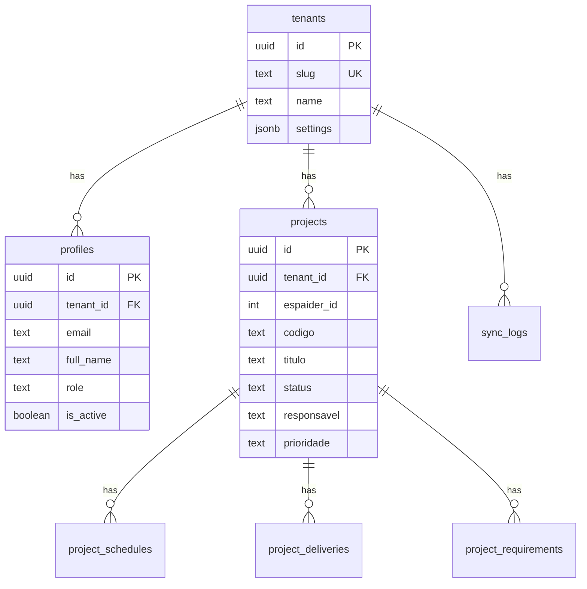

# Schema do Banco de Dados - Tech Arauz

> **Última Atualização**: 2026-02-10
> **Project Ref**: `pybmawlwpmxshtccpqui`
> **Dashboard**: https://supabase.com/dashboard/project/pybmawlwpmxshtccpqui

## Estrutura de Arquivos

```
supabase/
├── migrations/
│   ├── 001_initial_schema.sql    # Tabelas, índices, triggers, handle_updated_at
│   ├── 002_rls_policies.sql      # RLS, funções helper, policies, GRANTs
│   └── 003_seed_tenant_arauz.sql # Seed: tenant Araúz & Advogados
└── README.md                     # Este arquivo (runbook)

scripts/
└── apply-schema.sql              # Script consolidado idempotente (001+002+003)
```

## Tabelas (7)

| Tabela | Descrição | RLS | FK para |
|--------|-----------|-----|---------|
| `tenants` | Tenants do sistema (multi-tenant ready) | Yes | — |
| `profiles` | Extensão de auth.users com role e tenant | Yes | tenants, auth.users |
| `projects` | Projetos sincronizados do Espaider | Yes | tenants |
| `project_schedules` | Cronogramas (filho de projects) | Yes | tenants, projects |
| `project_deliveries` | Entregas (filho de projects) | Yes | tenants, projects |
| `project_requirements` | Requisitos (filho de projects) | Yes | tenants, projects |
| `sync_logs` | Auditoria de sincronizações | Yes | tenants |

## Diagrama ER



## Funções Helper

| Função | Tipo | Propósito |
|--------|------|-----------|
| `handle_updated_at()` | TRIGGER | Auto-atualiza `updated_at` em UPDATE |
| `get_user_tenant_id()` | SECURITY DEFINER | Retorna `tenant_id` do usuário autenticado (RLS) |
| `get_user_role()` | SECURITY DEFINER | Retorna `role` do usuário autenticado (RLS) |

## Roles e Permissões

| Role | Descrição | Projetos | Logs | Tenant |
|------|-----------|----------|------|--------|
| `admin` | Administrador | CRUD + DELETE | READ | READ + UPDATE |
| `user` | Usuário | CRUD (sem DELETE) | — | READ |
| `viewer` | Visualizador | READ | — | READ |

---

## RUNBOOK: Deploy do Banco

### Opção A: Script Consolidado (RECOMENDADO)

O script `scripts/apply-schema.sql` contém toda a estrutura de forma **idempotente**.
Pode ser executado múltiplas vezes com segurança.

1. Acesse o [Supabase Dashboard](https://supabase.com/dashboard/project/pybmawlwpmxshtccpqui)
2. Vá em **SQL Editor**
3. Copie e cole o conteúdo de `scripts/apply-schema.sql`
4. Execute
5. Verifique com as queries de verificação no final do script

### Opção B: Migrations Individuais

Execute na ordem (cada um depende do anterior):

```
1. 001_initial_schema.sql    → Tabelas + Índices + Triggers
2. 002_rls_policies.sql      → RLS + Functions + Policies + GRANTs
3. 003_seed_tenant_arauz.sql → Seed: Tenant Araúz & Advogados
```

### Opção C: Via MCP (após re-autenticação)

```
1. MCP: list_tables → confirmar estado atual
2. MCP: apply_migration("001_schema", <conteúdo 001>)
3. MCP: list_tables → confirmar 7 tabelas
4. MCP: apply_migration("002_rls", <conteúdo 002>)
5. MCP: apply_migration("003_seed", <conteúdo 003>)
6. MCP: get_advisors(security) → validar RLS
```

### Opção D: Via Supabase CLI

```bash
# Instalar CLI
npm install -g supabase

# Login
supabase login

# Linkar projeto
supabase link --project-ref pybmawlwpmxshtccpqui

# Aplicar migrations
supabase db push
```

---

## Após Deploy: Setup do Usuário Admin

### Passo 1: Criar usuário no Auth

1. Dashboard > **Authentication** > **Users**
2. Crie o usuário `gabriel@arauz.com.br`
3. Copie o **User UID** gerado

### Passo 2: Criar profile admin

Execute no SQL Editor (substituindo `<user_id_from_auth>` pelo UID real):

```sql
INSERT INTO public.profiles (id, tenant_id, email, full_name, role)
VALUES (
    '<user_id_from_auth>',
    '00000000-0000-0000-0000-000000000001',
    'gabriel@arauz.com.br',
    'Gabriel Cristofolini',
    'admin'
) ON CONFLICT (id) DO UPDATE SET
    role = 'admin',
    full_name = 'Gabriel Cristofolini';
```

> **Nota**: Se o user_id já é conhecido (`35fbb971-406b-4729-87c8-ef4fa261af47`), use-o diretamente.

---

## Checklist de Verificação Pós-Deploy

Execute estas queries para confirmar que tudo está correto:

### 1. Verificar tabelas criadas

```sql
SELECT tablename FROM pg_tables 
WHERE schemaname = 'public' 
ORDER BY tablename;
-- Esperado: 7 tabelas
```

### 2. Verificar RLS habilitado

```sql
SELECT tablename, rowsecurity FROM pg_tables 
WHERE schemaname = 'public';
-- Esperado: todas com rowsecurity = true
```

### 3. Verificar policies

```sql
SELECT tablename, policyname FROM pg_policies 
WHERE schemaname = 'public'
ORDER BY tablename;
-- Esperado: 18 policies
```

### 4. Verificar tenant

```sql
SELECT id, slug, name FROM public.tenants;
-- Esperado: 1 row, slug='arauz', name='Araúz & Advogados'
```

### 5. Verificar funções

```sql
SELECT routine_name FROM information_schema.routines 
WHERE routine_schema = 'public';
-- Esperado: handle_updated_at, get_user_tenant_id, get_user_role
```

### 6. Verificar triggers

```sql
SELECT trigger_name, event_object_table FROM information_schema.triggers 
WHERE trigger_schema = 'public';
-- Esperado: 6 triggers set_updated_at_*
```

---

## Troubleshooting

### Erro: "relation public.tenants does not exist"
**Causa**: Migration 001 não foi aplicada.
**Solução**: Executar `scripts/apply-schema.sql` no SQL Editor.

### Erro: MCP "permission denied"
**Causa**: MCP sem project-scoping ou OAuth expirado.
**Solução**: 
1. Verificar `?project_ref=pybmawlwpmxshtccpqui` em `.cursor/mcp.json`
2. Reiniciar o Cursor
3. Re-autenticar via browser

### Erro: "violates foreign key constraint" ao inserir profile
**Causa**: Tenant ou auth.user não existe.
**Solução**: 
1. Verificar `SELECT * FROM public.tenants` (tenant deve existir)
2. Verificar `SELECT id FROM auth.users` (user deve existir)

### Erro: RLS bloqueia acesso
**Causa**: Profile não existe ou role incorreta.
**Solução**: Verificar `SELECT * FROM public.profiles WHERE id = auth.uid()`

---

## Convenções de Migration

### Nomenclatura
- Formato: `NNN_descricao_snake_case.sql` (ex: `004_add_notifications.sql`)
- Numeração sequencial (001, 002, 003...)
- Nunca renomear ou editar migration já aplicada

### Regras
1. **CREATE TABLE IF NOT EXISTS** — sempre idempotente
2. **CREATE INDEX IF NOT EXISTS** — sempre idempotente  
3. **CREATE OR REPLACE FUNCTION** — funções são idempotentes
4. **DROP TRIGGER IF EXISTS + CREATE TRIGGER** — triggers precisam de DROP
5. **DROP POLICY IF EXISTS + CREATE POLICY** — policies precisam de DROP
6. Toda tabela deve ter `tenant_id UUID NOT NULL REFERENCES public.tenants(id)`
7. Toda tabela deve ter `created_at TIMESTAMPTZ DEFAULT NOW()`
8. Toda tabela deve ter trigger `handle_updated_at` (exceto sync_logs)
9. Toda tabela deve ter RLS habilitado
10. Verificar com `list_tables` + `get_advisors(security)` após aplicar
