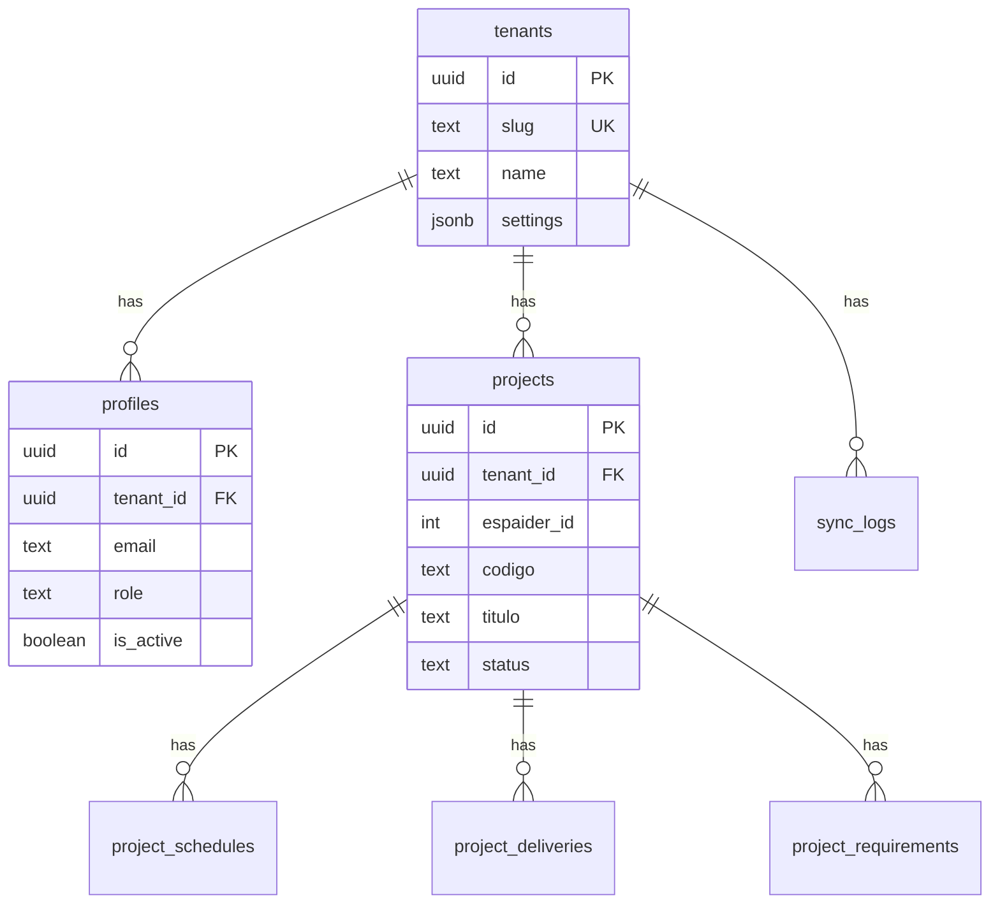

# Schema do Banco de Dados - Tech Arauz

## Estrutura

```
supabase/
├── migrations/
│   ├── 001_initial_schema.sql  # Tabelas, índices, triggers
│   └── 002_rls_policies.sql    # Row Level Security
└── seed.sql                    # Dados iniciais
```

## Tabelas

| Tabela | Descrição | RLS |
|--------|-----------|-----|
| `tenants` | Tenants do sistema | ✅ |
| `profiles` | Extensão de auth.users com role | ✅ |
| `projects` | Projetos do Espaider | ✅ |
| `project_schedules` | Cronogramas (filho) | ✅ |
| `project_deliveries` | Entregas (filho) | ✅ |
| `project_requirements` | Requisitos (filho) | ✅ |
| `sync_logs` | Auditoria de sincronizações | ✅ |

## Diagrama ER



## Roles e Permissões

| Role | Descrição | Permissões |
|------|-----------|------------|
| `admin` | Administrador | CRUD completo + logs |
| `user` | Usuário | CRUD projetos |
| `viewer` | Visualizador | Somente leitura |

## Deploy

### Via Supabase Dashboard

1. Acesse [supabase.com](https://supabase.com) > seu projeto
2. Vá em **SQL Editor**
3. Execute os scripts na ordem:
   - `001_initial_schema.sql`
   - `002_rls_policies.sql`
   - `seed.sql`

### Via Supabase CLI

```bash
# Instalar CLI
npm install -g supabase

# Login
supabase login

# Linkar projeto
supabase link --project-ref pybmawlwpmxshtccpqui

# Rodar migrations
supabase db push
```

## Após Deploy

1. Crie um usuário via Supabase Auth (Dashboard > Authentication)
2. Insira o profile do admin:

```sql
INSERT INTO public.profiles (id, tenant_id, email, full_name, role)
VALUES (
    '<user_id_from_auth>',
    '00000000-0000-0000-0000-000000000001',
    'gabriel@arauz.com.br',
    'Gabriel Cristofolini',
    'admin'
);
```
